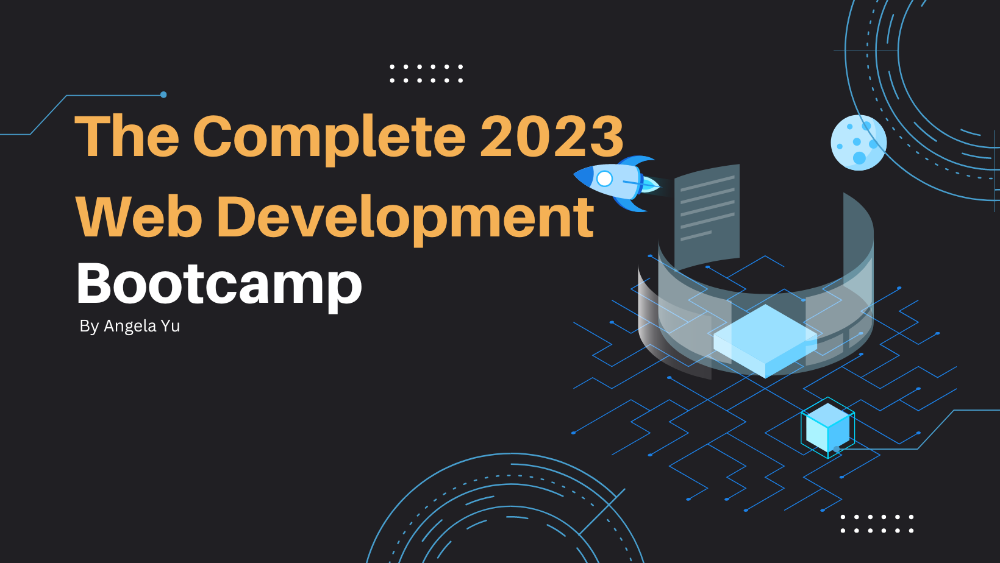
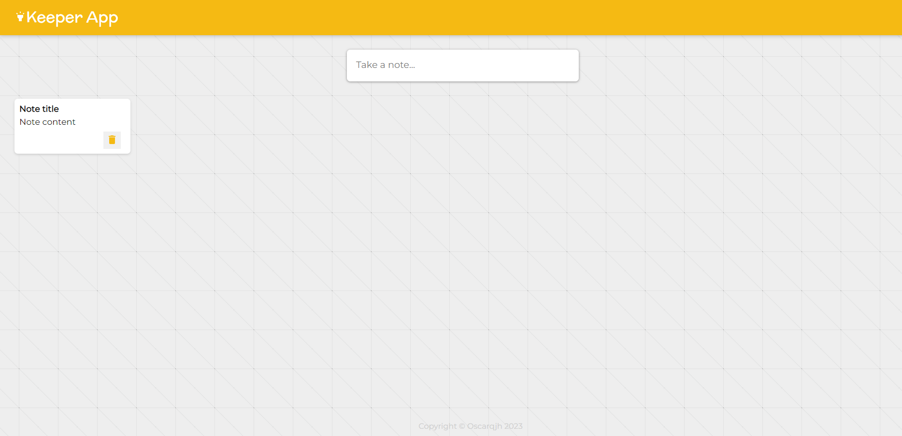
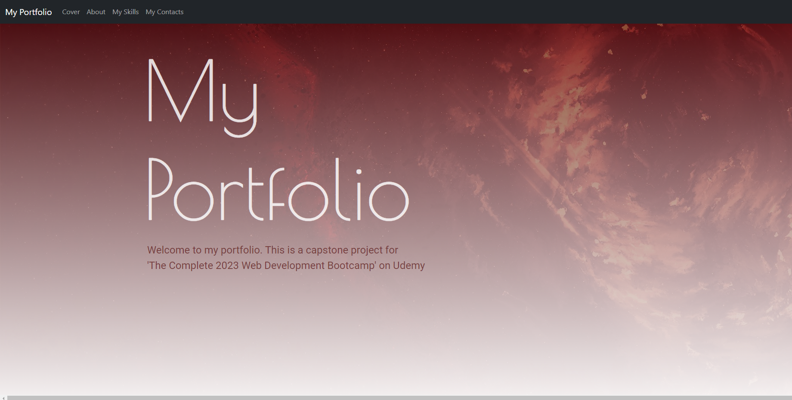
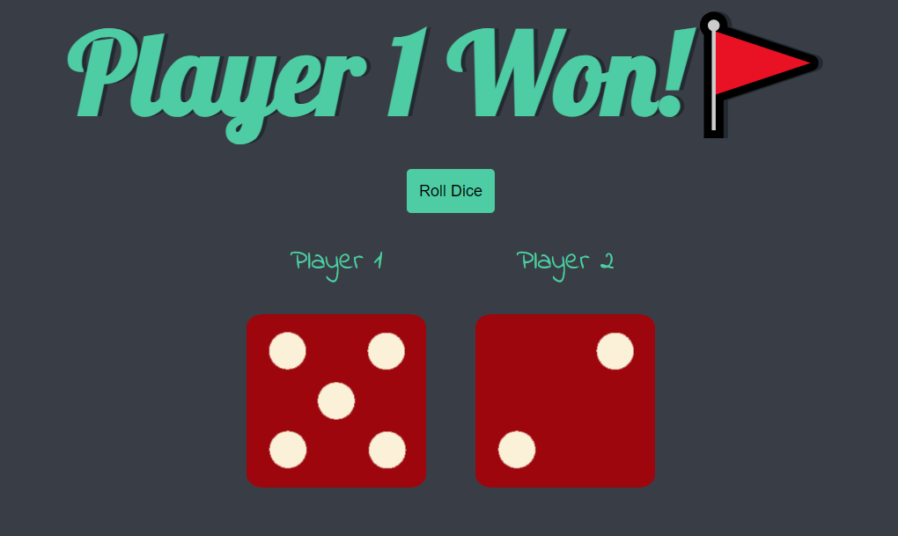
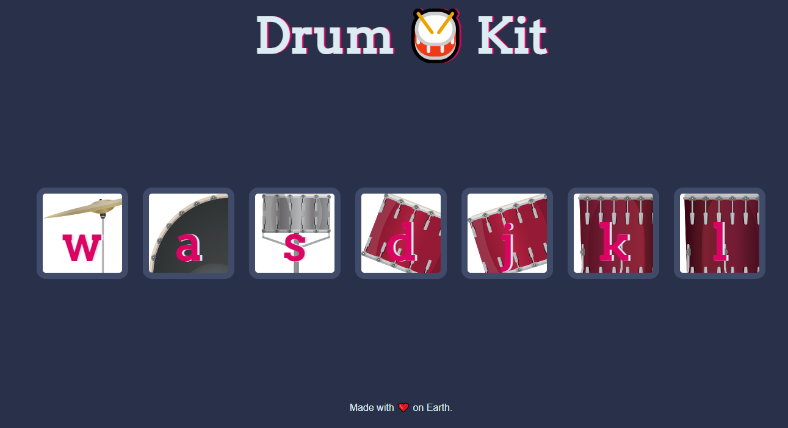
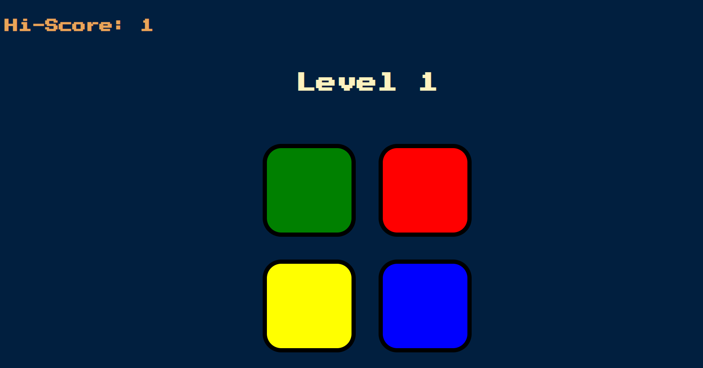
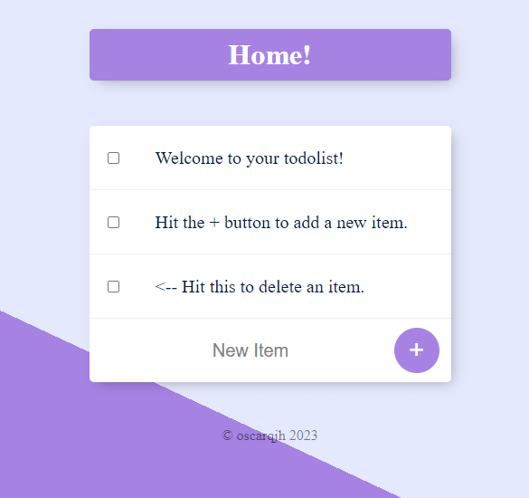

# 2023WebDevBootcamp

## Section 1: About

#### 1.1 Introduction

The Complete 2023 Web Development Bootcamp on Udemy is a course for aspiring full-stack web developers. This course is taught by the leader instructor (Angela Yu) at the App Brewey, London's leading in-person programming bootcamp. Learn more about the course [here](https://appbrewery.com/).

#### 1.2 Technologies Learned

Through this course, I've learned numerous technologies, tools and frameworks which aid me to become a full-stack web dev, including:

- HTML 5
- CSS 3
- Bootstrap 5
- Javascript ES6
- Express.js
- Node.js
- React.js
- MongoDB

Show more:

+ jQuery
+ Git, GitHub and Version Control
+ NPM
+ EJS
+ REST
+ APIs
+ SQL
+ Mongoose
+ React Hooks
+ Deployment with GitHub Pages, Heroku and MongoDB Atlas
+ Web3 Development on the Internet Computer
+ Blockchain technology

   

---

### Section 2: Projects

Throughout this course, I've made many projects, some with and without the guidance of video lectures. Since there are too many small projects, I'll only showcase some notable ones below.   

#### 2.1 Keeper App
This is a pure front-end note taking app made to practise React.js. Since backend is not implemented, data cannot be persisted past any one session. However, through this project, I learnt alot about **React.js** and **Material UI**, a React component library.   

    

Check out the application [here](https://oscarqjh.github.io/2023WebDevBootcamp-KeeperApp/).    
Source code can be found [here](https://github.com/oscarqjh/2023WebDevBootcamp-KeeperApp).   

#### 2.2 Portfolio Website
This portfolio website is made as part of capstone project 2 of the course. Through this project, I've learned to effectively use **Bootstrap** components to make a frontend only website.   

   

Check out the website [here](https://oscarqjh.github.io/2023WebDevBootcampPortfolioWebsite/).   
Source code can be found [here](https://github.com/oscarqjh/2023WebDevBootcamp/tree/main/course_modules/section13).

#### 2.3 Dice Game
This is a simple dice roller game made to practise basic **HTML, CSS and Javascript**.

   

Check out the game [here](https://oscarqjh.github.io/2023WebDevBootcamp-DiceGame/).   
Source code can be found [here](https://github.com/oscarqjh/2023WebDevBootcamp-DiceGame).   

#### 2.3 Drum Kit Game
This is a simple drum kit game made to practise **HTML's event listener**.

  

Check out the game [here](https://oscarqjh.github.io/2023WebDevBootcamp-Drumkit/).    
Source code can be found [here] 

#### 2.4 Simon Game
This is a pure front-end arcade game made to practise **Javascript**. It is pretty fun.   

  

Check out the game [here](https://oscarqjh.github.io/2023WebDevBootcamp-SimonGame/).   
Source code can be found [here](https://github.com/oscarqjh/2023WebDevBootcamp-SimonGame).   

#### 2.5 Todo List Website
This is a website to make your to-do list. This is the first proper project made with backend capability using **MongoDB**, meaning that data can be persisted past each session. Note: However since I am using free-tier to host the website on render, it can take a long time for the website to load.   

  

Check out the website [here](https://oscarqjh-todolist.onrender.com).   
Source code can be found [here](https://github.com/oscarqjh/2023WebDevBootcamp-TodoList).   

---

### Acknowledgment
- Angela Yu for her comprehensive web development bootcamp course, which served as the foundation for all the projects found here.   
